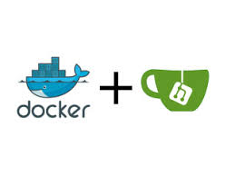

# gitea_registry #

Gitea - программное обеспечение для работы с открытым исходным кодом, система для  
организации совместной работы с репозиториями Git. По функционалу напоминает  
GitHub, Bitbucket, Gitlab.

Docker registry - локальный репозиторий для хранения и распространения docker-образов.

Сборка подготовлена с использованием СУБД PostgreSQL и отдельного Data-контейнера.

#### Зависимости для установки: ####
- git - для клонирования этого репозитория
- ssh-client - для клонирования по протоколу ssh
- docker - запуск процессов системы в изолированном пространстве
- docker-compose - инструмент определения и запуск многоконтейнерных приложений
- файлы ssl-сертификата и его приватного ключа

#### Ссылки на документацию ####
- [Docker](https://docs.docker.com/ "docs.docker.com")
- [Gitea](https://docs.gitea.io/en-us/ "docs.gitea.io")
- [PostgreSQL](https://www.postgresql.org/docs/ "postgresql.org")

#### Ссылки на страницы docker-образов ####
- [Gitea](https://hub.docker.com/r/gitea/gitea "gitea/gitea")
- [PostgreSQL](https://hub.docker.com/_/postgres "postgres")
- [Registry](https://hub.docker.com/_/registry "registry")
- [Busybox](https://hub.docker.com/_/busybox "busybox")

## Установка ##

Клонируем репозиторий, переходим в каталог с ним:

    $ git clone https://github.com/alex-telmun/gitea_registry.git && cd gitea_registry

Настраиваем PostgreSQL. Редактируем файл `postgres/src/init_db.sh`, меняем настройки БД для системы, имя пользователя.  
Также редактируем файл переменных среды - `env/postgres`, указываем пароль от суперпользователя СУБД.  
Пользователь по умолчанию - __postgres__, изменить его имя можно с помощью добавления новой переменной  
среды в файл - `POSTGRES_USER`. Дефолтное имя БД также __postgres__, для изменения можно использовать  
переменную `POSTGRES_DB`.  
Наcтраиваем __registry__. Планируется, что __registry__ будет запущен с ограничением доступа.  
Используется самый простой способ - базовая аутентификация с использованием файла `htpasswd`  
для хранения настроек подключения. Сгенерировать такой файл можно следующим образом:

    $ docker run --entrypoint htpasswd registry:2.7.1 -Bbn login password  > registry/auth/htpasswd

Изначально файл добавлен с учетными данными `dockeradmin:password`. __Рекомендуется__ перед запуском  
приложения сгенерировать новые настройки подключения и использовать ssl-сертификат (добавить файлы  
сертификата в `certs`)! Редактируем `env/registry`.  
Настраиваем Gitea. Редактируем `env/gitea`, указываем параметры подключения к БД (то, что записывали  
в `postgres/src/init_db.sh`), домен, __id__ пользователя и группы, название.  
Собираем проект. Добавляем в переменные среды __id__ рабочего пользователя и его группы с помощью "чтения" файла:

    $ source .env_file

Это необходимо, чтобы был прозрачный доступ к файлам СУБД из хостовой ОС, по этой же причине при настройке  
переменных Gitea желательно указать __id__, совпадающие с __id__ хостового пользователя.  
Собираем необходимые образы (в нашем случае будет только пересборка __postgres__):

    $ docker-compose build

Мастер-класс от коллеги-гуру: чтобы не забывать читать файл перед билдом, можно воспользоваться подобной  
функцией для командной оболочки:

    function docker-compose() {
      case "$1" in
        "build" )
          if [ -f .env_file ] && source .env_file;
          then command docker-compose build "${@:2}"; fi
          ;;
        * ) command docker-compose "$@"
          ;;
      esac
    }

После сборки, запускаем контейнеры приложения в фоне:

    $ docker-compose up -d

Будут запущенны три контейнера: `gitea-server`, `postgres-server`, `registry`. Четвертый контейнер (`postgres-data`)
будет иметь статус __Exited__, сделан для более удобной переносимости БД.

После запуска проекта рекомендуется настроить ssl в gitea, для защищенного соединения. Можно использовать тот же сертификат,
что и для registry - все необходимые тома уже монтируются внутрь контейнеров с помощью __docker-compose__. Останавливаем контейнеры:

    $ docker-compose stop

Добавляем в появившийся файл настроек `gitea/data/gitea/conf/app.ini` в секцию `[server]` дополнительные переменные:

    PROTOCOL  = https
    HTTP_PORT = 3000
    CERT_FILE = /certs/certificate.crt
    KEY_FILE  = /certs/private.key
    REDIRECT_OTHER_PORT = true
    PORT_TO_REDIRECT = 8443

Запускаем контейнеры:

    $ docker-compose up -d

## Использование ##

#### Gitea ####

Доступна по адресу [https://gitea.your-domain.com:3000/](https://gitea.your-domain.com:3000/).
Первый зарегистрированный пользователь будет являться глобальным администратором приложения.

#### Registry ####

Добавляем правило авторизации в реестре:

    $ docker login registry.your-domain.com:443
    Authenticating with existing credentials...
    WARNING! Your password will be stored unencrypted in /home/some_user/.docker/config.json.
    Configure a credential helper to remove this warning. See
    https://docs.docker.com/engine/reference/commandline/login/#credentials-store
    
    Login Succeeded

После введения правильного пароля, работа с реестром станет возможной:

    $ docker tag busybox:latest registry.your-domain.com:443/busybox:latest
    
    $ docker push registry.your-domain.com:443/busybox:latest
    The push refers to repository [registry.your-domain.com:443/busybox]
    eac247cb7af5: Pushed 
    latest: digest: sha256:24fd20af232ca4ab5efbf1aeae7510252e2b60b15e9a78947467340607cd2ea2 size: 527
    
    $ docker rmi registry.your-domain.com:443/busybox:latest
    Untagged: registry.your-domain.com:443/busybox:latest
    Untagged: registry.your-domain.com:443/busybox@sha256:24fd20af232ca4ab5efbf1aeae7510252e2b60b15e9a78947467340607cd2ea2
    
    $ docker pull registry.your-domain.com:443/busybox:latest
    latest: Pulling from busybox
    322973677ef5: Pull complete
    Digest: sha256:24fd20af232ca4ab5efbf1aeae7510252e2b60b15e9a78947467340607cd2ea2
    Status: Downloaded newer image for registry.your-domain.com:443/busybox:latest
    registry.your-domain.ru:443/busybox:latest

